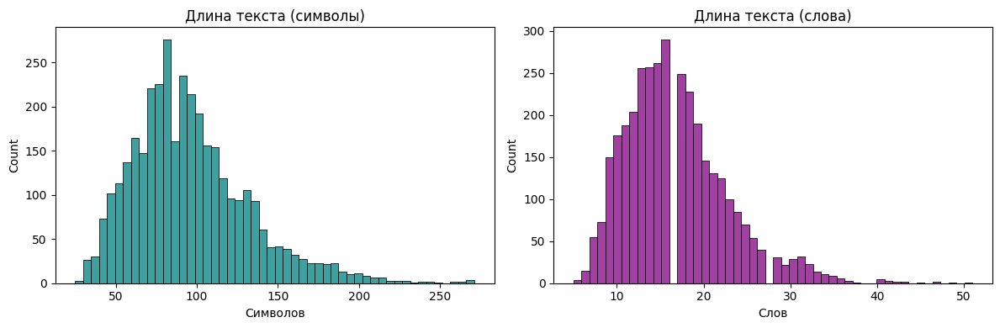
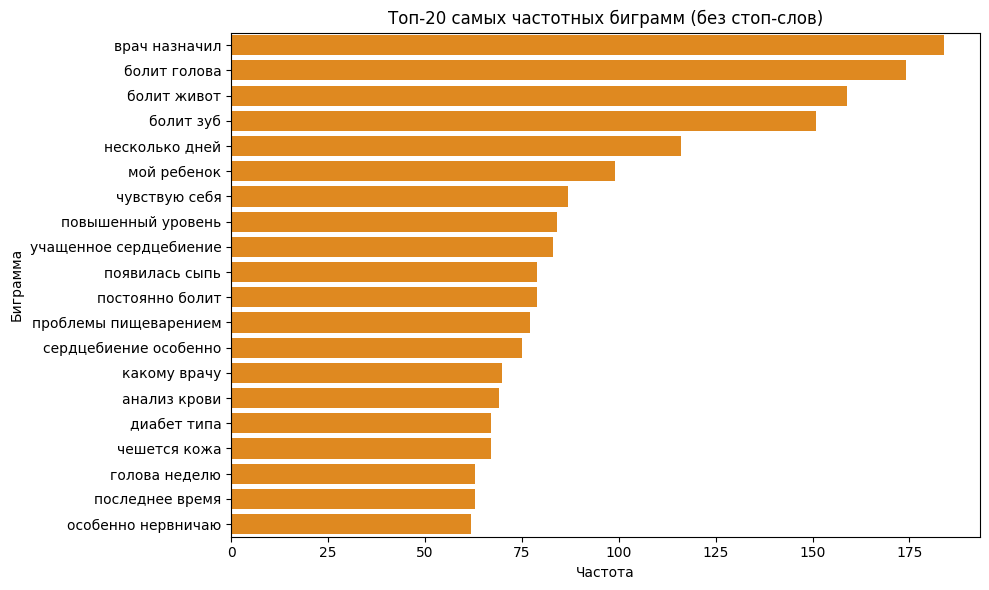
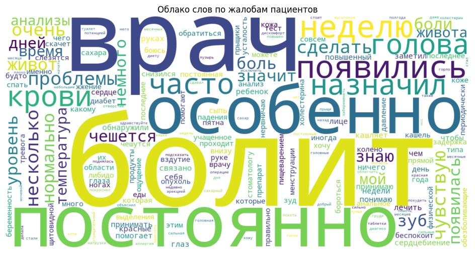
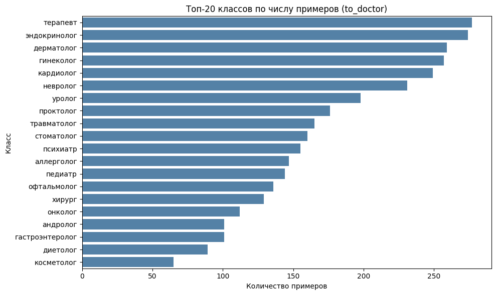
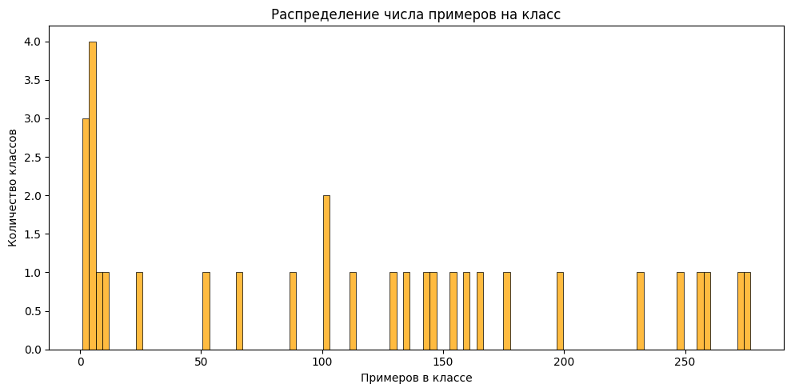

# Маршрутизация пациентов к врачу-специалисту средствами NLP

Проект по многоклассовой классификации медицинских обращений пациентов. По тексту вопроса/жалобы пользователя модель автоматически определяет, к какому врачу-специалисту его следует направить.

---

## Структура проекта

```
.
├── final_project.ipynb                      # основной ноутбук
├── bert_mistakes.csv                        # ошибки ruBERT-base на валидации
├── images/                                  # изображения для README
├
├── requirements.txt                         # зависимости проекта
├── .gitignor                                # исключения Git
└── README.md                                # описание проекта
```

---

## Технический стек

- Python 3.11
- PyTorch, Transformers (HuggingFace), Datasets
- scikit-learn
- pandas, numpy, matplotlib, seaborn, wordcloud
- Модели: `cointegrated/rubert-tiny2`, `DeepPavlov/rubert-base-cased`
- Полный список зависимостей в `requirements.txt`

---

## Содержание

1. [Постановка задачи](#1-постановка-задачи)
2. [Предобработка и анализ данных](#2-предобработка-и-анализ-данных)
3. [Моделирование](#3-моделирование)
4. [Анализ ошибок и укрупнение категорий](#4-анализ-ошибок-и-укрупнение-категорий)
5. [Финальное обучение и оценка на тесте](#5-финальное-обучение-и-оценка-на-тесте)
6. [Итоговый вывод](#6-итоговый-вывод)

---

## 1. Постановка задачи

Данные загружены из файлов `.parquet` (train и test). Каждая запись содержит три поля:

- `user_question` — текст вопроса или жалобы пациента
- `to_doctor` — специальность врача, к которому следует направить пациента (целевая переменная)
- `assistant_answer` и `prompt` — технические поля, намеренно исключённые из признаков

`assistant_answer` создаёт утечку данных: в реальном сценарии маршрутизации ответ ещё недоступен в момент принятия решения. `prompt` является техническим полем и не несёт содержательной информации о жалобе.

**Задача:** обучить многоклассовый классификатор, который по тексту `user_question` предсказывает значение `to_doctor`.

---

## 2. Предобработка и анализ данных

### 2.1 Очистка текста

На первом этапе все тексты в поле `user_question` были нормализованы:

- приведение к нижнему регистру
- удаление спецсимволов и цифр, сохранение русских и латинских букв
- нормализация пробелов

Результат записан в столбец `text_clean`. Для предварительного исследования применялась простая токенизация по пробелам. При обучении трансформерных моделей использовались встроенные токенизаторы, выполняющие subword-токенизацию в формате, необходимом для BERT-архитектуры.

**Распределение длин текстов** (по словам): большинство жалоб укладываются в 5–30 слов. 95-й перцентиль составляет около 40 слов, что подтвердило выбор `max_length=64` токенов при токенизации BERT-моделей как достаточного с запасом.



### 2.2 Анализ текста: частотные слова и биграммы

Среди наиболее частых слов в жалобах (без стоп-слов): **болит, врач, голова, живот, кровь, сдать**. Наряду с ними встречаются общие разговорные слова — типично для свободно написанных пациентских обращений.

Анализ биграмм выявил устойчивые симптоматические сочетания: *болит голова*, *болит живот*, *болит зуб*, *учащённое сердцебиение*, *анализ крови*, *диабет типа*. Это подтвердило целесообразность использования n-грамм в классических моделях.



Облако слов подтвердило результаты частотного анализа: в текстах преобладают слова, связанные с симптомами, самочувствием и результатами обследований.



**Вывод:** тексты содержат достаточно информативные признаки для классификации по врачебным специальностям.

### 2.3 Нормализация целевой переменной

Исходная разметка поля `to_doctor` содержала несогласованные варианты названий одной и той же специальности, например:

- «невролог» и «нейролог»
- «лор» и «отоларинголог»
- «семейный врач» и «терапевт»
- многие специальности записаны через слэш или запятую

Для унификации была составлена таблица `KEYWORDS_MAP`, приводящая все варианты к каноническому написанию. Дополнительно:

- класс «инфекционист» объединён с «терапевт»
- класс «флеболог» объединён с «хирург»
- единственная запись с классом «врач» (строка 2199) удалена как неинформативная

После нормализации классы train и test совпали полностью.

### 2.4 Анализ распределения классов

После нормализации обучающая выборка содержала **3545 объектов** и **31 класс**. Распределение оказалось неравномерным:

| Показатель | Значение |
|---|---|
| Минимум примеров в классе | 1 |
| Максимум примеров в классе | 277 |
| Медиана примеров в классе | 112 |
| Классов с единственным примером | 3 |



Распределение имеет выраженную асимметрию: небольшое число очень редких классов и группа крупных классов с 100–280 примерами.



Классы с числом примеров менее 2 были временно исключены для корректного стратифицированного разбиения на train/val при сравнении моделей. Это затронуло 3 объекта: выборка уменьшилась до **3542 объектов / 28 классов**. На этапе финального обучения редкие классы были возвращены обратно.

**Вывод:** наличие дисбаланса означает, что при оценке качества необходимо ориентироваться не только на Accuracy, но и на **Macro F1**, поскольку эта метрика равномерно учитывает все классы, включая редкие.

---

## 3. Моделирование

Для сравнения были обучены четыре модели на одном разбиении (80% train / 20% val, `stratify=y`, `random_seed=42`).

### 3.1 TF-IDF + LinearSVC (baseline)

Pipeline из TF-IDF векторизатора (юниграммы и биграммы, `min_df=2`, `max_features=200 000`) и линейного SVM.

| Метрика | Train | Val |
|---|---|---|
| Accuracy | 0.9672 | 0.8011 |
| Macro F1 | 0.9643 | 0.6174 |

Модель показала сильный результат и установила высокую планку для нейросетевых подходов. Существенный разрыв между train и val метриками указывает на переобучение — характерное явление для LinearSVC на небольших многоклассовых задачах с редкими классами.

### 3.2 Простая нейросеть на PyTorch (Embedding + Average Pooling)

Архитектура: слой `Embedding` → усреднение с маскировкой PAD-токенов → `Dropout(0.3)` → линейный классификатор. Словарь: 20 000 наиболее частых слов. Обучение с `Adam`, `lr=1e-3`, `CrossEntropyLoss`, early stopping по val loss с `patience=3`.

| Метрика | Train | Val |
|---|---|---|
| Accuracy | 0.8168 | 0.7405 |
| Macro F1 | 0.6309 | 0.5604 |

Модель демонстрирует стабильное обучение: `val_loss` снижался на протяжении всех 15 эпох, `val_macro_f1` вырос с 0.21 до 0.56. Однако по качеству она уступила как классическому baseline, так и трансформерным моделям. Кроме того, ручная реализация на PyTorch оказалась трудоёмкой: потребовалось вручную строить словарь, кодировать тексты, подготавливать тензоры и писать цикл обучения.

### 3.3 ruBERT-tiny (`cointegrated/rubert-tiny2`)

Компактная русскоязычная BERT-модель. Параметры: `lr=3e-5`, `batch_size=8`, `num_epochs=7`, `weight_decay=0.01`, выбор лучшей эпохи по `macro_f1`.

| Метрика | Val |
|---|---|
| Accuracy | 0.7983 |
| Macro F1 | 0.5979 |

Несмотря на компактный размер, модель показала результат, сопоставимый с baseline. Предобученные веса на русском корпусе позволяют эффективно работать даже на небольших данных.

### 3.4 ruBERT-base (`DeepPavlov/rubert-base-cased`)

Полноразмерная русскоязычная BERT-модель. Параметры: `lr=3e-5`, `batch_size=5`, `num_epochs=7`, `weight_decay=0.01`, выбор лучшей эпохи по `macro_f1`.

| Метрика | Val |
|---|---|
| Accuracy | 0.8194 |
| Macro F1 | 0.6254 |

Лучший результат среди всех моделей в базовой постановке. Полноразмерный BERT лучше справляется с разграничением близких медицинских специальностей благодаря более богатому контекстному представлению.

### Сводная таблица сравнения моделей

| Модель | Val Accuracy | Val Macro F1 |
|---|---|---|
| **DeepPavlov/rubert-base-cased** | **0.8194** | **0.6254** |
| TF-IDF + LinearSVC | 0.8011 | 0.6174 |
| cointegrated/rubert-tiny2 | 0.7983 | 0.5979 |
| Simple PyTorch NN | 0.7405 | 0.5604 |

**Вывод:** наилучший результат по основной метрике Macro F1 показала модель `DeepPavlov/rubert-base-cased` (0.6254). Второе место занял `TF-IDF + LinearSVC` (0.6174) — сильный и быстрый baseline. Компактный `ruBERT-tiny` также показал высокое качество (0.5979), тогда как простая нейросеть с ручным pipeline уступила более сложным подходам (0.5604).

---

## 4. Анализ ошибок и укрупнение категорий

### 4.1 Разбор ошибок модели ruBERT-base

Для лучшей модели `DeepPavlov/rubert-base-cased` был проведён детальный анализ ошибочных предсказаний на валидационной выборке. Всего зафиксировано **136 ошибок из 709 объектов**.

Анализ показал, что большинство ошибок связаны не со случайными промахами, а с путаницей между семантически близкими медицинскими специальностями. Наиболее часто встречающиеся ошибочные пары:

| Истинный класс | Предсказанный класс | Количество ошибок |
|---|---|---|
| дерматолог | косметолог | 9 |
| косметолог | дерматолог | 6 |
| андролог | уролог | 5 |
| уролог | андролог | 3 |

Часть ошибок возникает на коротких и недостаточно конкретных запросах, где по тексту сложно однозначно определить требуемую специальность — задача неоднозначна даже для человека-эксперта.

### 4.2 Укрупнение категорий

По результатам анализа ошибок были объединены пары классов с наиболее высокой взаимной путаницей:

- `косметолог` + `дерматолог` → `косметолог/дерматолог`
- `уролог` + `андролог` → `уролог`

Такое решение обосновано не только статистически: разграничение этих специальностей по тексту жалобы нередко невозможно даже для человека, а маршрутизация в одно из двух смежных направлений является приемлемым практическим результатом.

После укрупнения количество классов сократилось с 28 до 27. Модель `ruBERT-base` была переобучена на обновлённой разметке:

| Метрика | Val (до укрупнения) | Val (после укрупнения) |
|---|---|---|
| Accuracy | 0.8194 | **0.8458** |
| Macro F1 | 0.6254 | **0.6843** |

Слияние смежных классов улучшило обе метрики, что подтвердило правильность выбранного подхода.

---

## 5. Финальное обучение и оценка на тесте

### Конфигурация финальной модели

- **Модель:** `DeepPavlov/rubert-base-cased`
- **Разметка:** с укрупнёнными классами (27 классов)
- **Обучение:** на полном тренировочном наборе (3545 объектов, включая ранее отфильтрованные редкие классы), без валидационного сплита
- **Гиперпараметры:** `lr=3e-5`, `batch_size=5`, `num_epochs=7`, `weight_decay=0.01`

### Результаты на тестовой выборке (395 объектов)

| Метрика | Результат |
|---|---|
| Accuracy | **0.8430** |
| Macro F1 | **0.6575** |
| Правильных предсказаний | 333 / 395 |
| Ошибок | 62 |

Результаты на тесте соответствуют валидационным (`accuracy ≈ 0.845`, `macro_f1 ≈ 0.684`), что подтверждает устойчивость модели и отсутствие переобучения.

Основные оставшиеся ошибки сосредоточены на парах со схожими жалобами: `терапевт ↔ кардиолог`, `терапевт ↔ невролог`, `гинеколог ↔ репродуктолог`. Это ожидаемо для данной предметной области.

---

## 6. Итоговый вывод

Задача маршрутизации пациентов к врачу-специалисту по тексту жалобы решена с помощью полноразмерной русскоязычной BERT-модели. Ключевые результаты и наблюдения:

**Предобработка данных** оказала существенное влияние на итоговое качество. Нормализация несогласованной разметки целевой переменной и удаление неинформативных записей были необходимы для корректного обучения.

**Сравнение подходов** показало, что классический TF-IDF + LinearSVC является сильным baseline, уступающим `ruBERT-base` лишь незначительно. Простая нейросеть на PyTorch оказалась наименее эффективной среди рассмотренных подходов и потребовала непропорционально большого объёма ручной работы.

**Анализ ошибок** позволил выявить систематические паттерны путаницы и обоснованно объединить смежные специальности, что дало ощутимый прирост качества: Macro F1 вырос с 0.6254 до 0.6843 на валидации.

**Финальная модель** (`ruBERT-base` + укрупнённые классы, обучение на полном train) достигла на тестовой выборке Accuracy **0.843** и Macro F1 **0.658**, что демонстрирует хорошую обобщающую способность и практическую применимость решения.

Основным ограничением задачи является неоднозначность части запросов: короткие или общие жалобы объективно сложно отнести к единственной специальности, что задаёт естественный «потолок» для любой модели без дополнительного контекста.
